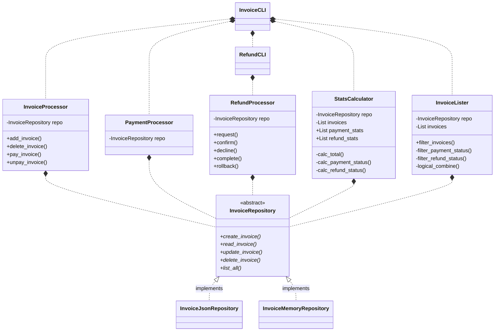

# Invoice Manager

This is a CLI app to manage and process invoices. You can import invoices from pdf files and manage their status via the CLI interface.

To request refunds, the app uses the Gmail API to send out emails. The invoice files the refunds are requested for are attached to the email.

### Technologies

The app relies on the following main technologies:

- Pydantic for data modelling
- Typer for CLI
- Pytest for testing
- Gmail API for sending emails


### Simplified Class Structure



### Installation

To install the app, clone the repository and run the following command:

```bash

# Create environment using the exported environment file
conda env create -f conda.yml

# Activate environment
conda activate invoices39

# Install python dependencies
poetry install

# Start the CLI and have a look at the documentation
invoice --help

```
